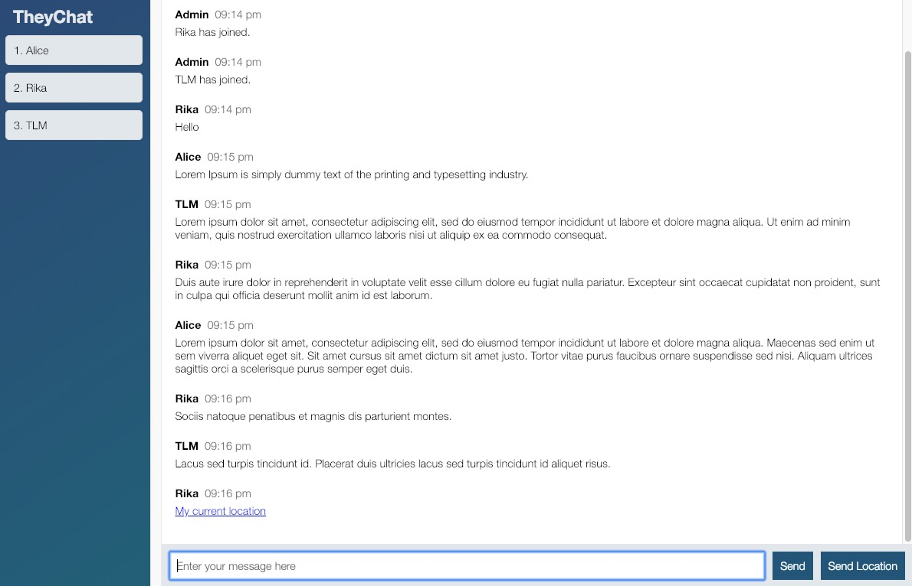

# TheyChat

## Background and Overview

`TheyChat` is a simple web chat application that users can join different chat rooms to send and receive messages in real time.

## Architecture and Technologies

- `Javascript` for overal structure
- `Socket.io` for live messaging
- `HTML5` and `CSS3` for styling

## Functionality and Features

- Users can join different chat rooms, messages are private to each room
- Users can see a list of people present in a chat room that updates in real time
- Users can send / receive messages and location information to other members in the same chat room

## UI

## Possible future features

- Profile pictures
- List of active chat rooms on the join page
